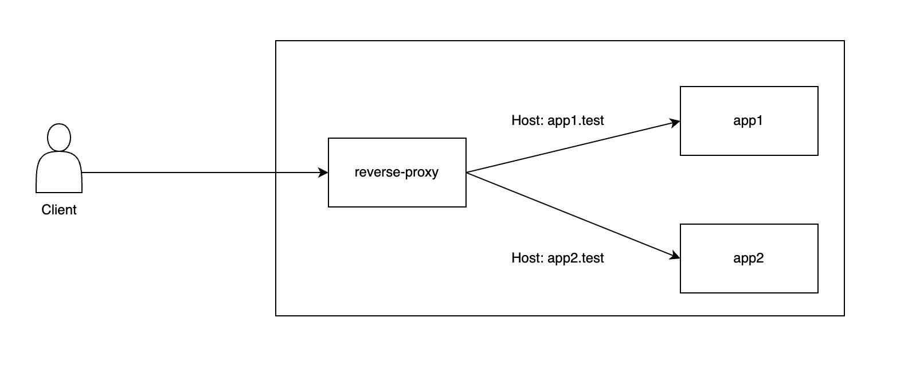

# Playground nginx
<!-- https://viewer.diagrams.net/?tags=%7B%7D&highlight=0000ff&edit=_blank&layers=1&nav=1&title=architecture.drawio#R5VjLbuMgFP2aLBPZPPxYtkkfi85opGg07apibGrTIcbCpHH69YNjHIeQph1Nk7TqKnCBC5xz7kHOAI5n9ZUkZf5NpJQPgJfWAzgZAOAjEOifJrJsI6EXt4FMstRM6gNT9kxN0DPROUtpZU1UQnDFSjuYiKKgibJiREqxsKc9CG7vWpKMOoFpQrgb%2FcVSlbfRCIR9%2FJqyLO929gNzvxnpJpubVDlJxWIjBC8GcCyFUG1rVo8pb8DrcGnXXb4wuj6YpIV6y4JJ%2Fv3mrrpn95dgmA4ff07DCA47ep4In5sbm9OqZQeBFPMipU0WbwDPFzlTdFqSpBldaNJ1LFczrnu%2BbrqnMgd9olLReiNkTnlFxYwqudRTzCiIUbvESAYgg%2BCiJwDF5uD5BvjricSQnq1z97johoHmH2Dq1LiBipAqF5koCL8RojS3f6RKLY2IyVwJGxsNiVzeGhxXnbumM8Jdd1JvDk6WpmcTUCkp%2FtCx4ELqSEofyJyrZk3N1G23k25v5Na9PnXT6TK%2FyFYl5jKh%2BxDBphiJzKjaMxG282hq1ZlLvqScKPZkl90uIs3SH4LpM69Fg7BniQZiPIrDCOHA8xEMAA7sjO0FTZItdaxP9R%2BC8R3BNAhMTbcQBXWIPaKiPpmG0Ik0FPsjL8Y%2BBoEHAfQxPqqGoGPNpCxdXfUi8l%2B3ZyITI6a91L3drAMU2mYduWbtd0%2FgplkHh%2FJqtAu2fa%2FaR4ANeaeGzUef0rFe5OJVU%2Bnc59Cusqaxf5neZCNOIhDZmoHhVqL2yod707BTWZJqyVd0WEpRLz9YiUG0hTvAJy4x4FrTtaj0rmfNbtrbR4pWyoFR31dtYcVZVuh2otGhuh7OG1SY%2Fmg5MwMzlqZ8Va%2B0Ys%2FkN%2B9wLRtxrO6Fzwd40uTSJVq1wPtOnZmqf2Ccb4XegSAUbxG0ywO9HQSBgxHkKtwiCHxtghA4OUGRQ5DDhv7OLldvT6IaPI7wwRphW8c%2BGLlWg47qNLGD05gzWnwd7UZb3hKGOzjB76Nd3e3%2Fxmlf2%2F7PMHjxFw%3D%3D -->

This is a simple local playground for understanding how to configure nginx
